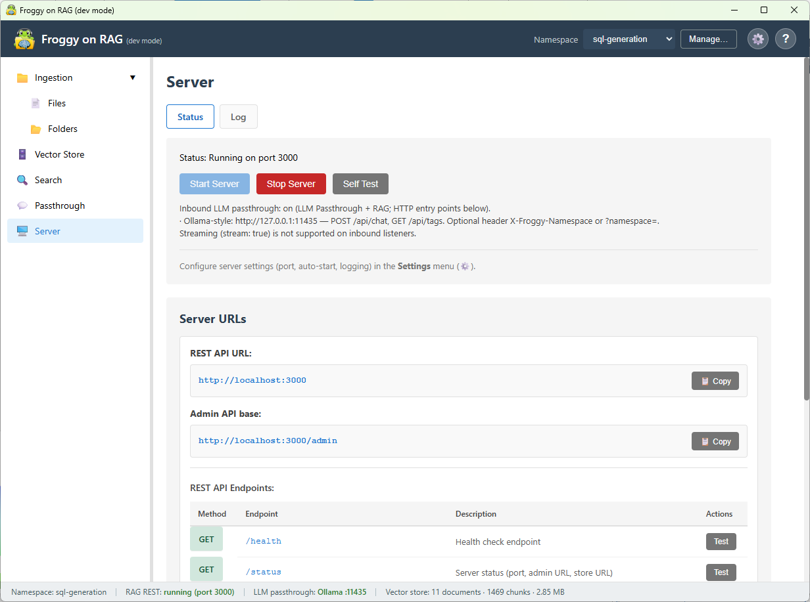
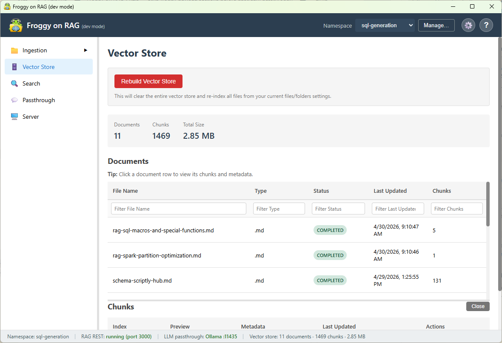
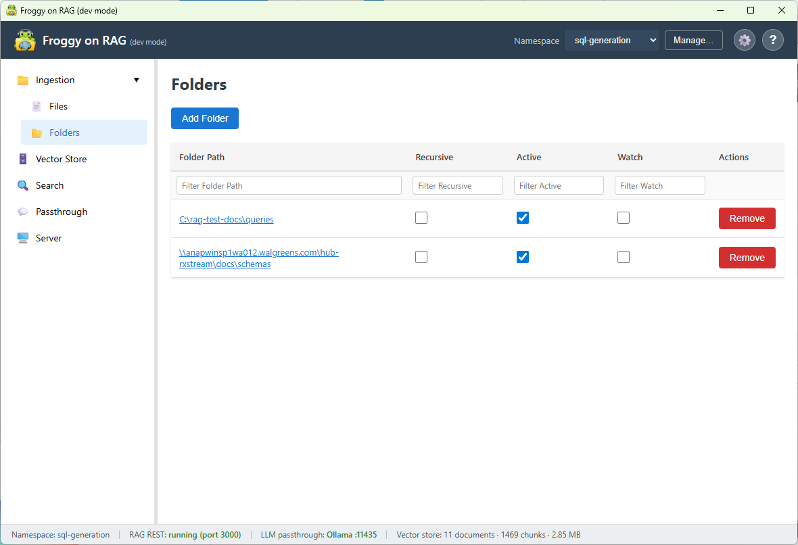
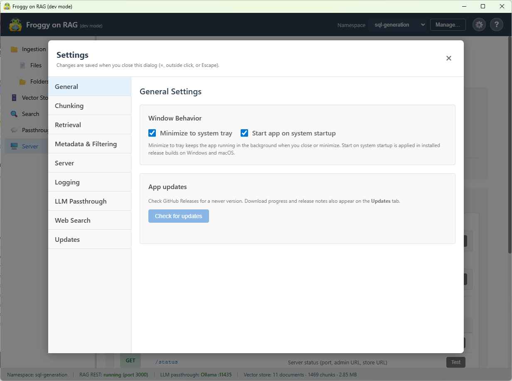
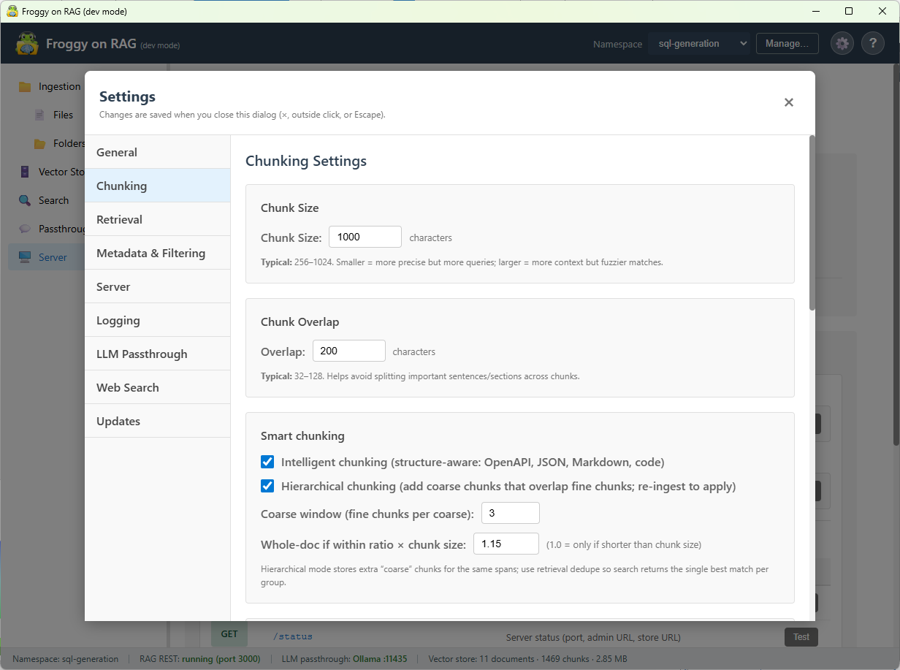
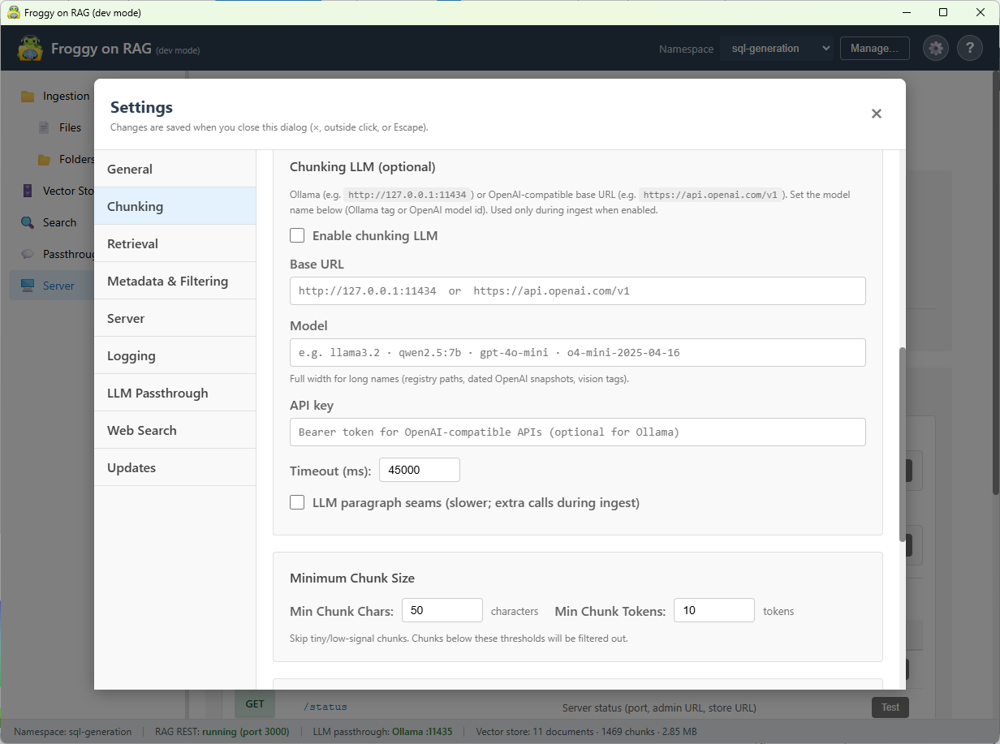
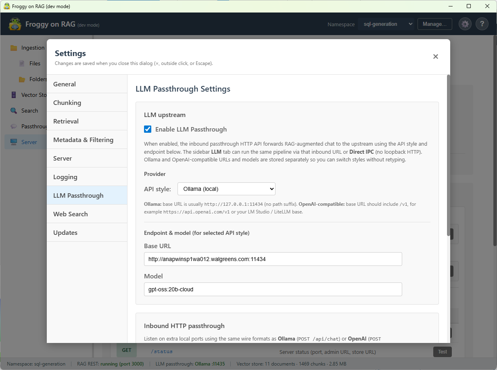
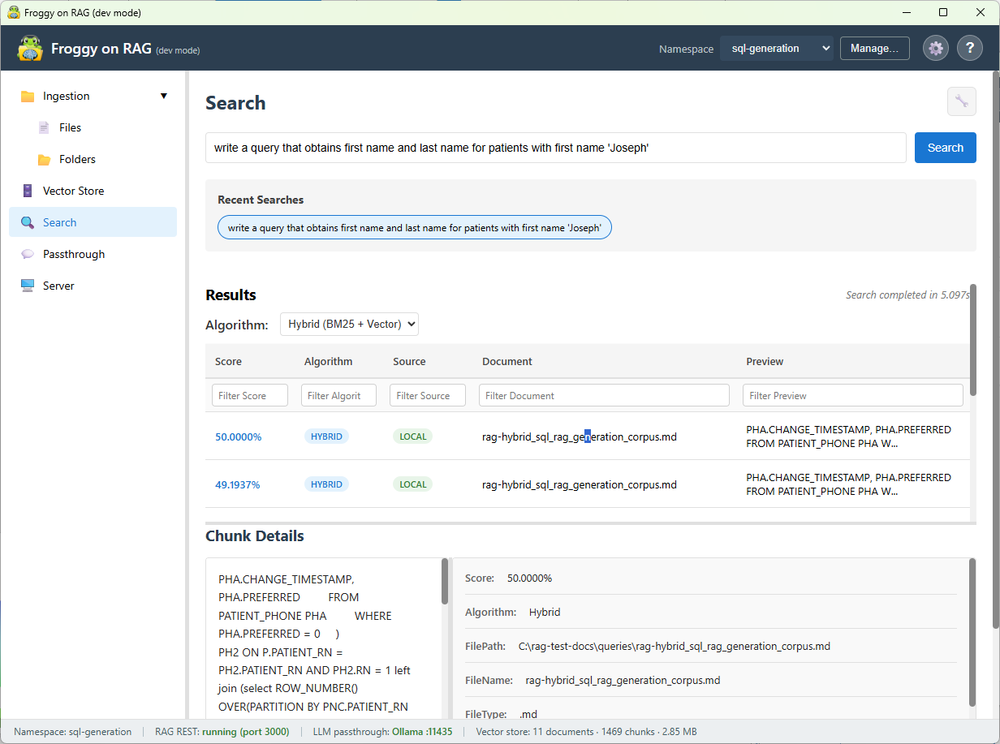
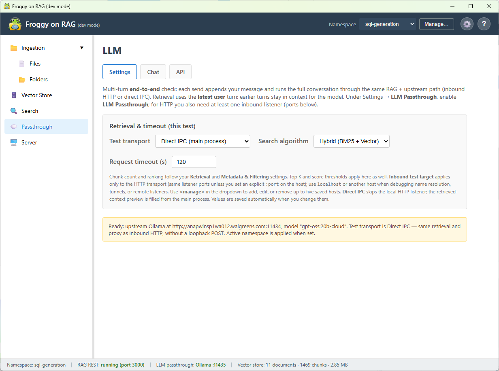

# 🐸 Froggy RAG

> Point your app at Froggy. Get RAG automatically.

Froggy RAG is a **local desktop app** that sits in front of your LLM and
exposes **two familiar HTTP APIs**:

- **OpenAI-compatible** routes (for clients and SDKs that expect OpenAI-style
  chat/completions URLs and payloads).
- **Ollama-compatible** routes (for tools and scripts already aimed at a local
  Ollama server).

**RAG behaves the same on both.** Namespaces, retrieval, chunking, optional
web search, and prompt injection all run in one pipeline before your request is
forwarded. You only choose which API shape your client speaks; you do not
reimplement RAG twice.

No agents.\
No tool wiring.\
No orchestration.

Just:

    Your app → Froggy → LLM (with context already injected)


------------------------------------------------------------------------

# 🚀 Why Froggy?

Most RAG setups push complexity into every application:

- You wire retrieval tools or sidecar services per stack.
- You merge retrieved text with prompts by hand.
- You duplicate logic across OpenAI-style and Ollama-style callers.
- Or you adopt a heavy framework just to glue pieces together.

**Froggy centralizes that work in one local hop.** You keep using the HTTP
clients and URLs you already have; Froggy **intercepts → retrieves → injects →
forwards**. That means faster iteration for internal tools, fewer “forgot to
attach context” mistakes, and one place to tune ingestion, namespaces, and
passthrough behavior.

> **Intercept → Retrieve → Inject → Forward**

Your existing clients do not need a redesign. Point their base URL at Froggy
instead of straight at the model, and they gain grounded answers from your
corpora with minimal code churn.

------------------------------------------------------------------------

# 🧠 What it actually does

When a compatible request hits Froggy (OpenAI-style **or** Ollama-style):

1. **Interprets the request** — Uses the same message or completion shape your
   client already sends, so you are not maintaining parallel request types for
   RAG.
2. **Searches the active namespace** — Pulls embeddings and ranked chunks from
   the corpus you selected, so answers stay tied to *your* documents instead of
   only the model’s training cut-off.
3. **Pulls the most relevant context** — Surfaces the passages that actually
   match the query, which reduces hallucination on domain-specific tasks.
4. **Optionally adds web search** — When configured, blends in fresh web
   results with retrieved docs so answers can combine private knowledge and
   current public information.
5. **Injects into the prompt** — Prepends structured context the model can
   cite, so downstream apps do not each implement their own “system prompt +
   snippets” pattern.
6. **Forwards to your LLM** — Sends the enriched request to the upstream you
   configured (local or remote), preserving compatibility with your existing stack.

**Same steps, same quality bar,** whether the inbound call looked like OpenAI or
like Ollama. Only the wire format at the edge differs.

------------------------------------------------------------------------

# 🧩 Core Concepts

## Namespaces

Example names you might use:

    personal-notes
    sql-examples
    work-docs
    codebase

**Value:** Each namespace is an isolated knowledge island: its own documents,
embeddings, and retrieval scope. Switching namespace is how you switch *which*
corpus grounds the model—without redeploying clients or changing API keys. That
keeps HR docs separate from engineering notes and makes multi-tenant or
multi-project workflows manageable from one app.

------------------------------------------------------------------------

## Passthrough API (OpenAI **and** Ollama)

Froggy speaks **both** common local-LLM API dialects on configurable ports.

- Use **OpenAI-shaped** URLs and JSON when your stack already uses OpenAI SDKs
  or Chat Completions–style proxies (for example inbound **`/v1/chat/completions`**
  on the OpenAI listener).
- Use **Ollama-shaped** URLs when your workflow assumes `ollama run`, REST
  paths, or tools hard-coded for Ollama (for example inbound **`/api/chat`**
  on the Ollama listener).

**Value:** You are not locked to one ecosystem. The **retrieval and injection
pipeline is identical** for both: same namespaces, same chunk store, same
injection rules, same optional web search. Pick the surface that matches your
client; Froggy still does the RAG work once.

Example body shape (OpenAI-style messages; Ollama callers send their native
equivalent and get the same enrichment path):

```json
{
  "messages": [
    { "role": "user", "content": "Write a SQL query..." }
  ]
}
```

Froggy enriches the conversation and forwards to your configured upstream.

------------------------------------------------------------------------

## Prompt Profiles

Reusable behavior templates, for example:

- sql-generation
- sql-modification
- general-rag

**Value:** Profiles encode *how* retrieved context should be framed and which
behaviors apply, so you can swap “modes” without rewriting client code. Teams
can standardize on a small set of profiles instead of scattering one-off system
prompts across every integration.

------------------------------------------------------------------------

## Tags & Metadata

```json
"tags": ["patient", "phi"],
"metadata": { "platform": "databricks" }
```

**Value:** Tagging and metadata let you filter or prioritize chunks at
retrieval time, so sensitive or environment-specific material is easier to scope
and audit. That improves relevance for specialized queries and supports
policies like “only search PHI-tagged docs in this namespace.”

------------------------------------------------------------------------

# 🖥️ Desktop App

The Windows installer delivers a **single local bundle**: vector store,
ingestion, REST/RAG controls, passthrough listeners, and settings—no separate
server farm to operate for personal or team use.

- Installer-based (Windows)
- Auto-updates
- Runs locally
- Includes UI + API

Screenshots live in [`images/`](images/) (splash) and
[`images/screenshots/`](images/screenshots/) (in-app captures).

## Server & corpus

See whether core services are up, which ports are listening, and how the app is
wired to your machine—**value:** you get a quick health picture without reading
logs or guessing from a blank terminal.



Browse namespaces, inspect the vector side of the house, and relate “what I
indexed” to “what search will hit”—**value:** operators and developers share one
surface to verify that the right corpus exists before debugging client calls.



## Ingestion

Point Froggy at folders or files and pull them into a namespace—**value:** you
refresh knowledge continuously from source trees or document drops without
writing a custom ETL for every project.



## Settings

Tune project paths, defaults, and behavior that apply across both API
front-ends—**value:** one configuration layer backs both OpenAI- and
Ollama-shaped clients.



Control how documents are split and embedded—**value:** better chunking often
beats a larger model; you can adapt chunk size and overlap to your doc shapes
without code changes.





Configure inbound listeners, upstream LLM URLs, and passthrough options—**value:**
you decide where Froggy listens and which real model answers, while Froggy
remains the single place that injects RAG.



## Local API tests

Run **search** and **passthrough** exercises inside the app—**value:** you can
prove retrieval and end-to-end OpenAI/Ollama compatibility before you point a
larger system at Froggy, which shortens the “is it the client or the corpus?”
debug loop.





------------------------------------------------------------------------

# ⚙️ Installation

**Value:** a packaged app plus auto-update keeps security patches and features
flowing without you maintaining a Python environment or Docker stack for daily
use.

Download the latest Windows installer from **GitHub Releases** for this
repository (replace with your fork’s releases URL if you publish builds
elsewhere).

------------------------------------------------------------------------

# ⚙️ Usage

Start the app, enable the **OpenAI-compatible** and/or **Ollama-compatible**
listeners in settings, then aim your client at Froggy’s host and port using the
**same paths and bodies** you would use against vanilla OpenAI HTTP APIs or
Ollama—**except** the base URL now points at Froggy.

Examples (ports are configurable; placeholders show the idea):

    http://localhost:<froggy-openai-port>/...   # OpenAI-compatible paths
    http://localhost:<froggy-ollama-port>/...   # Ollama-compatible paths

**Same RAG on both:** whichever entrypoint you call, Froggy runs the same
retrieval, optional web search, and injection, then forwards to the upstream LLM
you configured. Switching from an OpenAI-style client to an Ollama-style client
does not change how your documents are found or merged into the prompt.

------------------------------------------------------------------------

# 🐸 TL;DR

Froggy is a **local passthrough** with **OpenAI- and Ollama-compatible APIs**.
Your clients keep their native shapes; **RAG is identical on either path**—one
pipeline, one place to manage corpora and settings, smarter answers on every
forwarded request.
